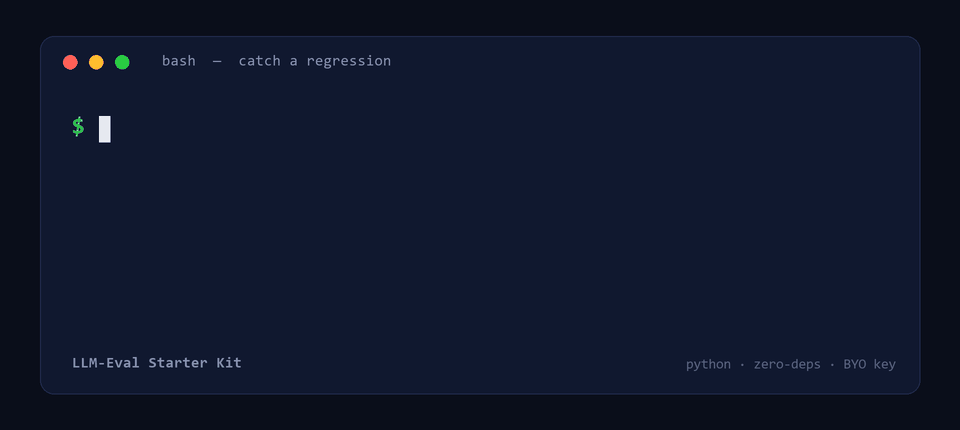

# llm-eval-harness

A tiny, dependency-free harness for scoring LLM answers against a gold set.

Evaluating a language model by hand stops scaling almost immediately. Ten answers
are fine; a thousand, re-run every time someone tweaks a prompt, is not. This is a
small, boring Python tool that makes the evaluation **consistent and repeatable**:
give it a set of questions with known answers and the model's answers, and it
returns an accuracy score plus a list of exactly which items failed and why.

- **No dependencies.** Standard library only (Python 3.8+).
- **Per-question match rules** — `exact`, `contains`, `numeric` (with tolerance) —
  so each answer is judged the way it should be, instead of forcing everything
  through exact match and quietly reporting wrong numbers.
- **Actionable output.** Every miss comes back with the question, the expected
  answer, and what the model actually said.
- **CI-friendly.** Exits non-zero when any item fails, so it drops straight into
  a CI step or a pre-commit hook.

## Quickstart

```bash
python llm_eval.py examples/gold.json examples/answers.json
```

Output:

```
accuracy: 80%  (4/5)

FAIL q5: How many bits are in a byte?
     expected: '8'
     got:      'A byte has seven bits.'
```

Note how `q4` (gold `Not Found`) passes even though the model wrapped it in a
sentence — that is the `contains` rule doing its job. The one genuine miss, `q5`,
is caught because `numeric` matching reads `seven` as no usable number.

## How it works

### The gold set

Keep your evaluation data as plain JSON so anyone can edit it without touching code:

```json
[
  {"id": "q1", "question": "What year did the first moon landing happen?", "answer": "1969", "match": "contains"},
  {"id": "q2", "question": "What is pi to two decimals?", "answer": "3.14", "match": "numeric", "tol": 0.01},
  {"id": "q3", "question": "Name the capital of France.", "answer": "Paris", "match": "contains"}
]
```

The `match` field is the important part — it tells the scorer *how* to compare:

| match | passes when… |
|-------|--------------|
| `exact` | the normalized model answer equals the normalized gold answer |
| `contains` | the normalized gold answer appears inside the model answer |
| `numeric` | the first number in each is within `tol` (default `0.0`) |

Normalization lowercases, trims, collapses whitespace, and drops trailing
punctuation — so `contains` correctly passes an answer like *"The moon landing was
in 1969."* against gold `1969`, which an exact-match-only script would have marked
wrong and sent you chasing a non-bug.

### The answers file

A simple `{id: answer}` object:

```json
{
  "q1": "The first moon landing was in 1969.",
  "q2": "Pi is about 3.14159",
  "q3": "The capital of France is Paris."
}
```

### Using it as a library

```python
import llm_eval as le

gold = le.load_gold("examples/gold.json")
answers = le.load_answers("examples/answers.json")
accuracy, failures = le.score(gold, answers)
```

## Validation

Bad eval data causes more wrong conclusions than bad models do, so `load_gold`
fails loudly on it: it rejects duplicate ids, unknown match types, and `numeric`
items whose answer contains no number.

## Tests

```bash
python -m pytest -q
```

## Background

This grew out of a write-up on automating LLM answer evaluation:
[Automating LLM Answer Evaluation with a Small Python Scoring Script](https://dev.to/zahid23saim/automating-llm-answer-evaluation-with-a-small-python-scoring-script-4f8o).

## Pro version — LLM-Eval Starter Kit



This harness covers `exact` / `contains` / `numeric` matching, and it's free forever (MIT).

When you need the next steps for real evaluation work, the
**[LLM-Eval Starter Kit](https://saimzahid8.gumroad.com/l/llm-eval-kit)** builds on this repo and
adds:

- more match rules — `regex`, `all_of`, `any_of`, `choice`, `json_field`
- **LLM-as-judge** rubric grading (bring your own key; OpenAI / OpenRouter / local)
- **pass@k** for sampled and agentic runs
- **regression diffs** — see exactly which items a model or prompt change broke, wired for CI
- shareable HTML / Markdown / JSON reports

Still zero dependencies, standard library only. **Launch price $24** for the first two weeks →
<https://saimzahid8.gumroad.com/l/llm-eval-kit/LAUNCH>

## License

MIT — see [LICENSE](LICENSE).
